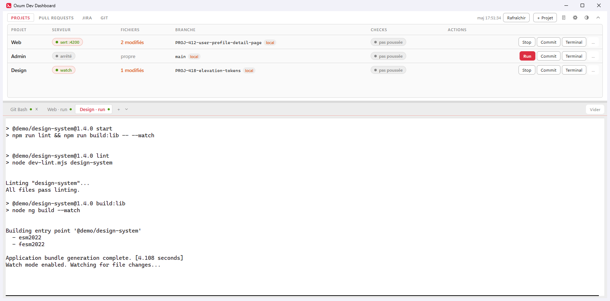

# Oxum Dev Dashboard

A terminal with a status strip above it. The strip tells you where each front-end project stands
(dev server, git, GitHub checks); every action it offers runs in a tab of that same terminal, so
nothing ever sends you to an external console.



## What you need on the machine

The dashboard runs commands rather than reimplementing them, so what it can do depends on what is
already installed. Nothing here is bundled, and nothing here is fatal: a missing tool disables the
features that use it and says so where the command was going to run.

| Tool | Needed for | Without it |
| --- | --- | --- |
| **Windows 10/11 x64** | everything | the app is Windows-only (ConPTY, `taskkill`) |
| **git** on `PATH` | every column of the strip, the whole Git tab | rows read `?` and the Git tab reports the failure |
| **Git Bash** | the shells that expand aliases, the `Commit` action | those actions print `command not found` in their tab |
| **`gh`**, authenticated (`gh auth login`) | Checks, Workflows, the Pull requests tab | those columns read `?`, the tab stays empty |
| **`claude`** on `PATH`, signed in | Triage, `Work on this`, `Generate` a commit message | the run fails in its own tab or line |
| **A Jira API token** | the Jira tab, the Triage tab | nothing is queried at all, no error |
| **Node 20+** | only to build from source | irrelevant to a downloaded build |

**One** feature expects a shell helper that does not ship with the app: the **Worktrees** tab's
create, rename and remove entries run a shell function called `wt`. It prints `command not found` in
the tab it opened, which names what is missing in the place it was going to be used, and nothing else
is affected. Reimplementing it is deliberately refused: `git worktree add` and `remove` carry rules
(a shared `node_modules` junction to unlink first, a refusal on a folder git no longer knows, a stale
registration to prune) that a second implementation would get wrong, and getting one wrong deletes
work. The reasoning is in `CLAUDE.md`.

Two other features used to need one and no longer do. **Create a branch** in the Jira tab creates
`KEY-slug-of-the-summary` with git directly, and the seeded **`Commit`** action is gone: the Git tab
commits with a real form, an amend and `Generate` writing the message from the staged diff. Actions
are configuration anyway, so a row button running anything you like is one line in the settings.

### First launch

A fresh install watches **nothing**, on purpose: a project costs a `git` process on every poll, so the
app does not adopt repositories nobody chose. The table's empty state offers the two ways in, `Add a
folder` for one repository, or the settings to name the folder your clones live in and then `Detect
repositories`. Everything else (poll cadences, the Jira connection, the Claude models) has a working
default or is inert until configured.

## Install

One permanent link, always the latest build:

**[Download oxum-dev-dashboard-win-x64.zip](https://github.com/jpaniagua-dev/oxum-dev-dashboard/releases/latest/download/oxum-dev-dashboard-win-x64.zip)**

Right-click the archive before unpacking, Properties, **Unblock**. The build is unsigned, so Windows
marks it as coming from the internet and SmartScreen warns on the first launch; unblocking the zip once
saves unblocking every file inside it. Then unpack it anywhere and run `Oxum Dev Dashboard.exe`.

Close a running dashboard before replacing its folder: open files cannot be overwritten, and all the
builds share one single-instance lock, so launching the new exe would only focus the window already up.

### Build it yourself

```bash
npm install
npm run dev          # run from source
npm run dist         # build the installer, the zip and the portable build
npm run dist:zip     # only the zip, under the name the GitHub release carries
```

`dist` produces three artifacts in `release/`, and the choice between them is a measured trade-off:

| Artifact | Install | Time to a window |
| --- | --- | --- |
| `…-<version>-x64.exe` (NSIS installer) | yes | ~10 s |
| `…-<version>-x64.zip` | no, unpack once | ~10 s |
| `…-<version>-portable.exe` | no, single file | **~26 s, every launch** |

The GitHub release carries that same zip under a version-free name, which is what keeps the download
link above permanent; `dist:zip` is the script that renames it. Which version you are running is in the
title bar.

The single-file portable target unpacks the whole ~100 MB app into `%TEMP%` at **every** start, and it
does not cache: measured at 30 s cold and 26,5 s on the next launch, against 9,6 s once unpacked. Prefer
the zip unless you really need one self-contained file, on a USB stick for instance.

All three carry the same `appId`, so they read the same settings in `AppData\Roaming`: the install-free
builds are there to avoid an install, not to be isolated. For the same reason the single-instance lock is
shared, and launching one while another runs focuses the window already open instead of starting a
second.

`dev` passes `--watch`, so a change to the **main process** restarts it instead of leaving a
hot-reloaded renderer talking to a stale main. Without it, the two drift apart the moment an IPC
contract changes, and the symptom is a button that quietly does nothing.

Windows only. No C++ build tools required: the pty ships as a prebuilt Node-API binary, which loads
in Electron unchanged.

## What each column means

On first launch the dashboard looks under your repositories root for a few common folder names
(`web-app`, `admin-front`, `design-system`) and seeds a row for each one it finds. That is only a
starting point, and an unrecognised layout simply starts empty: `+ Project` adds a folder,
**double-clicking a project name renames it**, **dragging a row reorders the table**, and everything
else is editable in the settings dialog.

The order is part of the configuration, not a view setting: drop a row where you want it and the
settings window, the new-tab menu and the Servers window follow, on this machine and after a restart.

The port is not shown in the list: the server pill already says `serving :4201` when it matters.

| Column | Reads |
| --- | --- |
| Server | The dev process phase, read from its own terminal output |
| Files | Staged / modified / untracked, counted separately |
| Branch | Current branch, with `↑↓` divergence and a `local` badge when never pushed |
| Checks | Pull request check rollup, or why there is nothing to show |

### Server phases

Not a boolean, because the `start` scripts run `npm run lint` before serving and a two-state model
would report that healthy window as "down".

`stopped` · `starting` · `lint` · `build` · `serving :port` · `watch` · `lint failed` · `build failed` · `crashed`

Every one of them describes a process **the dashboard owns**. There used to be an `external` state,
fed by a port probe that mapped listening ports back to repositories; it went away once every launch
went through the embedded terminal. It was a state nobody could act on, for a situation that had
stopped happening. The trade-off is explicit: if something outside still holds the port, the row says
`stopped` and the action fails on "address already in use", visibly, in its own tab.

`watch` exists because **a component library is not a server**: its `start` typically runs
`ng build --watch`, which opens no port. Nothing about it can be observed from the outside, which is
precisely why the dashboard spawns it and reads its output.

## Pull requests

The top strip has six tabs, `Projects`, `Pull requests`, `Jira`, `Git`, `Triage` and `Worktrees`. Only
the strip changes: the terminal below keeps its space whichever is selected, and each tab remembers its
own height.

The pull request tab lists the watched repositories on the left with a counter, and the pull requests of
the selected one on the right, one line each:

```
#128  PROJ 412 user profile detail page      [author] [review requested] [4 green]  33 min  >_
#127  PROJ-408: invoice lifecycle actions    [review requested] [no review] [no checks]  18 min  >_
```

- **Which repositories**: derived from each project's `git remote get-url origin`, with a
  `Follow pull requests` checkbox per project in the settings. Nothing to maintain twice, and the
  trade-off is explicit: a repository you have not cloned cannot be followed.
- **Which pull requests**: the open ones that involve you, as author or with your review requested. That
  is the question the tab exists to answer; on an active repository the full list buries it. One
  `gh pr list` call per repository brings everything, and the filter is applied locally.
- **`no review` is not an approval.** `gh` reports an empty `reviewDecision` when the repository
  requires no review at all, and painting that green would claim something GitHub never said.
- Clicking a line opens the pull request in your browser. The **terminal icon** at the end of the row
  opens a new tab in that repository's folder instead — the same glyph the Git tab's repository column
  uses, because it is the same gesture. It said `Terminal` in words until the icon existed, which was
  the widest thing on the row after the title, spent on saying what every gesture in this app implies.
  Both are quiet until the row is hovered, and both keep their name in `aria-label`.
- The poll runs every 180 s by default (`pullsPollSeconds`), one call per followed repository, which is
  far below any rate limit.

## Jira

A third strip tab, same master-detail grammar: `Current sprint` and `My issues` on the left with their
counts, the issues of the selected view on the right. Clicking an issue opens it in the browser, there
being no local equivalent of a ticket.

Unlike GitHub, there is no pre-authenticated CLI to lean on, so the connection is configured in the
settings: site URL, account email, project keys, and an Atlassian API token.

- **The token is encrypted at rest** by `safeStorage` (DPAPI on Windows, keyed to your account) in its own
  file, never in `settings.json`. It is never read back towards the settings window: to change it, type a
  new one, and an empty field means "keep the stored one".
- **If the platform cannot encrypt, the token is refused** rather than written in the clear.
- **`Test`** runs one real search, because only that proves the credentials and the project keys
  together.
- The status shown is the one your team configured; the colour comes from Jira's status **category**,
  which is the only part of a workflow that means the same thing on every board.
- **Right-click an issue** to assign it to yourself or move it to another status. The available moves are
  read from Jira when the menu opens, never cached: a workflow decides what is legal from the current
  status, and a remembered list would offer moves Jira then refuses. Assigning goes through the account id
  behind your token, so it cannot target anyone else. Both write straight to Jira and the view refreshes
  at once.
- Issues are laid out in columns, assignee then status. `My issues` drops the assignee column, since
  every row would carry your name.
- **Both views are limited to the open sprints.** `My issues` is what the sprint holds *and* is assigned
  to you, not everything assigned to you: an issue outside every open sprint does not show up here, the
  board being the place to see a whole assignment.
- **What is in progress comes first**, in both views. Grouped by Jira's status *category*, never by the
  status name, so "In review" and "Ready for QA" rank with everything else the team is working on. Inside
  each group the order the search returned is preserved: `status, key` for the sprint, most recently
  updated first for yours.
- Nothing is queried until the site, the email and the token are all set. Poll every 300 s by default
  (`jiraPollSeconds`).

## Git

The fourth tab, and the one where the strip stops being a glance and becomes a place to work: pick a
repository on the left, then `Changes`, `Branches` or `History` in the middle, and read the diff
on the right. The boundary between the working column and the diff is draggable and remembered.

```
Changes 12  Branches 4  History                     ↻  ↓  ↑
[x] MM  src/app/feature/x.component.ts
[ ] ·M  src/app/feature/x.component.html
```

- **Staging is per file**, and the two status columns are never merged: `MM` is a file staged *and*
  edited again, and flattening that into one state would make the checkbox lie about what the commit
  will contain. Clicking a row shows its diff, ticking the box stages it, and the two gestures do not
  interfere.
- **The commit runs in a terminal tab**, not silently. `husky` and `lint-staged` can take half a minute
  and print everything that explains a refusal; run in the background all of that collapses into a
  one-line failure. The message travels through a file rather than a `-m` argument, so it can be
  multi-line and nothing in it can be read as an option — a subject starting with `-` is a real thing
  people type. The file is kept, so a rejected commit does not lose what you wrote.
- **`Generate` writes the message from the staged diff**, with a headless Claude Code run. It starts
  **in the repository**, which is the point: Claude Code reads `CLAUDE.md` from the folder it is
  launched in, so it follows that repository's own commit convention without this app knowing what the
  convention is. Recent subjects go in as a fallback for a repository that documents nothing. The diff
  is passed in the prompt rather than fetched, the run being allowed to read files and nothing else.
  It fills the field and never commits: the answer is a draft you correct, and the commit stays the
  separate click it already was. With the amend armed it describes the last commit plus whatever is
  staged on top, which is what an amend actually is. Pick its model in Settings.
- **Amend is a checkbox next to the commit button.** Arming it pre-fills the form with the whole
  message of the commit being rewritten and relabels the button; with nothing staged it is a reword,
  so the empty-index rule bends for it. The tooltip names the sha it will rewrite and warns when that
  commit is already pushed. Two steps on purpose: rewriting history must not be one stray click away
  from the gesture that does not.
- **Branch names are validated by `git check-ref-format`**, not by a pattern of ours: git's rules are
  subtler than they look, and an approximation either refuses a legal name or lets git fail later while
  talking about something else.
- **Checkout is a button per branch**, never a click on the row: it changes what is on disk. Nothing is
  stashed and nothing is forced, so a checkout blocked by local changes fails and git says which files
  are in the way.
- **`Pull` is fast-forward only.** A merge or a rebase can stop on a conflict, and this strip has
  nothing to offer someone standing in a half-finished rebase; refusing to start one is the only
  outcome it can honestly explain. A diverged branch is a terminal's business. `Push` publishes a new
  branch with `-u origin <branch>` on its first run.
- The three network operations are the icons at the end of the tab row; right-clicking the header row
  (or the `⋯` button) also offers them plus a terminal in the repository.
- **Every repository in the left column carries a terminal icon**, which opens a new tab in that folder.
  It sits beside the row rather than inside it, and that is deliberate: clicking it does not select the
  repository, so getting a shell somewhere never triggers a git read of a repo you were not looking at.
- Reads are **pulled**, not polled: only the selected repository is ever on screen, so branches, history
  and status are read when you open the tab, change repository or write something — never in the
  background for a tab nobody is looking at.

What this tab deliberately does **not** do: stash, resolve conflicts, rebase, or stage individual hunks.
All four leave the repository in an intermediate state it could neither show nor finish. Conflicts are
painted as errors in the list rather than hidden among the modifications, precisely to send you to the
terminal.

### Checks verdicts

`not pushed` (no upstream, so no pull request can exist) · `no PR` · `no checks` ·
`en cours` · `OK n` · `KO n`

`no checks` is deliberately distinct from a green rollup: two real open pull requests returned an empty
rollup, and painting that green would be a lie.

## Triage

The fifth tab, and the only one that spends minutes rather than milliseconds. Pick a sprint on the left, press the play button, and a **read-only
Claude Code process** classifies every ticket in it; the verdicts land in sub-tabs so what you can start
today is not buried under what nobody can move.

```
Ready 4  Decision 3  Backend 2  Unclear 1  Blocked 0   Analysed 12 min ago   [Work 4 ready]
```

- **Five verdicts, not three.** `ready`, `needs-decision`, `backend`, plus `unclear` and `blocked`: a
  ticket whose description is too thin to act on is a different problem from one waiting on an API, and
  merging them hides the one a single sentence would fix. Every verdict keeps its tab even at zero, since
  a tab that comes and goes between two analyses moves the others under the cursor.
- **The counts sit on the tabs**, so choosing one is never a guess and nothing is hidden silently: from
  `Backend` you can still see that four tickets are ready.
- **A run is watchable, not just "busy".** The bar streams what the model is doing, the file it is
  currently reading, the step count and the elapsed time. It is **indeterminate on purpose**: nothing here
  knows how long a run takes, and a bar filling at an invented pace would be a promise the tab cannot
  keep.
- **The last result stays** until the next run on that sprint. It is stored in its own `triage.json`
  beside the settings, not inside them, so any other tool on the machine can read the verdicts back.
  A failed run keeps the previous ones and only adds the error above them.
- **A third column explains the verdict**: why the ticket landed there, the question that has to be
  answered, and what answering it triggers. Without it, checking a verdict means opening Jira in a
  browser, which is the trip this tab exists to save.
- **Every ticket is estimated too**, in story points on a Fibonacci scale, by the same pass that read the
  description. The number shows next to the status, and an estimate the model did not give stays empty
  rather than being filled with a default: it gets written to the ticket and planned against.
- **`Work on this` hands the ticket to Claude Code** in a terminal tab, after asking which repository it
  lives in. Only the key and that repository name are passed: the analysis is already on disk, so the
  session reads the verdict itself rather than receiving a copy that starts going stale immediately.
  `Work N ready` does the same for the whole `ready` group, and only for that group, because a ticket
  parked on a question is one whose answer decides what gets built.
- **The session starts in the workspace above your repositories, not inside the one it will work on.**
  Claude Code reads its instructions and skills from the folder it starts in and that folder's
  ancestors, so a session launched inside a single repository never sees what several of them share one
  level up. It starts at `claudeContextRoot` and is told which repository the ticket is about. Set that
  key to an empty string in `settings.json` to go back to starting inside the repository.
- **It also records the handoff on the board**: the ticket is moved to the active sprint, assigned to
  you, given its story points and moved to in progress. Every button says so before you press it, and
  the result says what went through. None of it can stop the session: the tab opens first, the writes
  run after, and a Jira that is unconfigured or refusing is reported in a sentence rather than treated
  as a failure of the gesture.
- **Permission prompts are off** for these sessions (`--dangerously-skip-permissions`): the ticket was
  read, the repository was chosen from a menu, and the session exists to do the work.

Needs the `claude` CLI on your `PATH` and the Jira connection above. The analysis process gets `Read`,
`Grep` and `Glob` and nothing else: it reads, it never writes. A handed-over session is the opposite,
which is exactly why it lands in a tab you can watch and kill.

## Worktrees

The sixth tab, and the only one with no repository to pick first: one flat list of every **linked git
worktree** across every watched project, a terminal button on each line, and the life cycle beside it.

```
10 worktrees across 3 of 4 projects                              [ New worktree ]

Web        PROJ-123-web-app        PROJ-123-thousands-separator                clean         ⋯
Web        wip-toast-web-app       wip/toast-zone-escape          3 modified   ↓4            ⋯
Admin      PROJ-1647-admin-front   PROJ-1647-list-sorting                      clean  local  ⋯
```

- **git is the authority, not a folder scan.** The list comes from `git worktree list --porcelain` per
  project, so it finds the ones created outside your usual location and it can name the ones that are
  registered while their folder is gone (`prunable`). A scan of a conventional directory would miss the
  first and could not tell the second from a live checkout.
- **The main checkout is left out**: it already has a row in the Projects tab, and the comparison that
  excludes it normalises separators and case, since git prints `C:/repos/web-app` where the settings
  hold `C:\repos\web-app`.
- **The state is the project table's own.** Same `modified` / `staged` / `clean` counts, same `↑↓` gap
  and same `local` badge, read with the same function: one definition of "dirty" for the whole app,
  rather than a second one drifting next to the first.
- **Clicking a line opens a new tab in that worktree's folder**, the same gesture as the `Terminal`
  button of a project row. The whole row is the button, so it works with Tab and Enter too, and there is
  no terminal glyph on it: the row *is* that gesture, and a second glyph beside the menu would read as a
  second button. A `prunable` row is inert: its folder is gone, so there is nothing to open.
- **The dots open the life cycle**: `Remove`, `Remove and delete the branch`, `Rename…`, and
  `New worktree` in the summary bar. They are visible at rest rather than on hover, because forgetting
  that the gesture exists at all is the thing this answers.
- **What the menu offers depends on what the row says.** `--force` appears only on a worktree with
  uncommitted work, labelled with how many changes it will discard; a plain `Remove` never carries a
  flag, so git refusing it on unmerged work is a normal outcome. A `prunable` row gets one entry, and it
  drops the stale registration rather than deleting anything.
- **Read when shown, then on the git poll**, like the Git tab, and never for a hidden tab: it is the
  widest read of the strip (one `git worktree list` per project, then a status per worktree). A read is
  skipped while a name is being typed.

The tab does not implement the life cycle, it **spawns** it. `git worktree add` and `remove` have rules
worth getting right (unlink a shared `node_modules` junction *before* the removal or it survives as an
orphan, refuse a folder git no longer knows about, prune a stale registration instead of deleting it),
so each entry runs a shell helper (`wt new`, `wt mv`, `wt rm`) in a terminal tab rather than a second
implementation of those rules in here. Same choice as `dev <TICKET>` in the Jira tab. The helper is
called bare, so it comes from your own shell profile; without one, the tab says `wt: command not found`
where the command was going to run.

## Servers window

The dev servers can live in a window of their own, so a second monitor answers "does one of them need
me" without you cycling through tabs. The rack icon next to the settings gear moves them across; the
dashboard keeps the shells and the Claude Code sessions.

```
3 servers                                          [ Back to the dashboard ]

┌─ web-app · start ──────[serving :4200]┐ ┌─ admin-front · start ─[build failed]┐
│ ✔ Compiled successfully               │ │ ERROR in src/app/list.ts:42         │
└───────────────────────────────────────┘ └─────────────────────────────────────┘
┌─ design-system · start ────[watch]────┐
│ Build at 14:02:11                     │
└───────────────────────────────────────┘
```

- **What moves is decided by the action's role.** A `server` action goes; a `task`, a shell and a Claude
  Code session stay. One started while the window is open goes straight there.
- **What the role cannot know, you can say.** Right-click a tab for `Move to the servers window`, for a
  `npm run start` typed by hand into a shell. The arrow on a tile sends that one back.
- **The tiles carry the phase**, the same `serving` / `lint failed` / `crashed` verdict the projects
  table shows, read from the process output. The tile's border takes the colour, so the answer is
  legible from across a room. That is the one thing a terminal opened beside the app cannot do.
- **Nothing about the processes changes.** A detached server keeps running and keeps its scrollback, and
  `Run` / `Stop` in the strip still drive it. Closing the window hands the terminals back to the
  dashboard rather than leaving them somewhere nothing can stop them.
- **The window remembers.** Left detached, the app reopens it on the next launch, at the position and
  size it had on that screen.

## Actions

Actions are **configuration, per project**. Each one is a command line, a shell profile to run it in,
and a role; the buttons on a row are that list, in order. Nothing about `Run` or `Commit` is wired in
the code any more, they are only what a project ships with by default.

A **role** is what makes an action behave:

| Role | Owns the row's server state | Replaced by `Stop` while running | Tab closable |
|---|---|---|---|
| `server` | yes, its output is parsed for build markers | yes | only once stopped |
| `task` | no | no | always |

A project has **at most one `server` action**: a row holds a single server state, so two of them would
have two processes writing the same phase and the last one to print would win. Promoting an action
demotes the previous holder.

Defaults on a new project, and why each ships with the shell it does:

- **Run** → `npm run start` in **cmd**, because a pty does not resolve the `.cmd` shims that make a
  bare `npm` work. Never disabled: see **Run restarts** below.
- **Commit** was seeded until 5.8.2 and no longer is, because it ran a shell **alias**: bash does not expand aliases
  in a non-interactive shell, so it is run with `-ic`. It is a full-screen prompt_toolkit TUI, which is
  the reason this app embeds a real pseudo-terminal rather than a log view.

The command is handed to the shell as a **single argument**, so `&&`, quotes and paths with spaces
survive. An unrecognised shell falls back to cmd's `/c` rather than guessing a flag.

Two buttons are not actions, because they open something instead of running a command: **PR** (the
pull request in your browser, disabled when there is none) and **`>_`** (a shell in the repository).

**Run restarts.** Clicking it on a `server` action that is still running stops that process, waits for
it to actually be gone, and relaunches — a dev server does not release its port the instant it is
killed, so starting without the wait would fail on `address in use` for a reason that has nothing to do
with your code. The wait is capped at 8 seconds, after which the relaunch happens anyway and the tab's
own output tells the story. `Stop` is unchanged: while a process of ours is alive the button is `Stop`,
so a server can still be ended at any moment. And a `task` in flight is never restarted, only a server
is: `Commit` runs hooks for half a minute and a second click must not kill a commit halfway.

The button also stopped being disabled. It used to grey out whenever the row believed it owned a
process, blaming a server started outside the dashboard — a message left from a port probe that no
longer exists, and false in the state that actually reached it. A row whose state disagrees with the
sessions is precisely when you need a way out, and a dead button is the opposite of one.

**Stop** kills the process tree with `taskkill /T`. A plain kill would only reach the `cmd.exe`
wrapper and leave `ng serve` holding the port. Deleting an action closes its tab for the same reason:
a running server with no button left to stop it would keep the port for good.

Closing the window asks for confirmation when the dashboard owns running servers, since they die
with it. Servers you started from a terminal are never touched.

## Settings

The gear in the strip's tab row opens a window with five sections.

**Interface** holds one number: the font size of the application itself, 11 to 17 px, 13 by default.
Every other size in the app is a **ratio** of it — column headers, badges, lists and diffs all keep
their proportions as it moves — so this scales the whole interface rather than one piece of it. The
terminal is deliberately not on that ladder: it has its own size below, because "can I read the app"
and "how much output fits in a pane" are different questions. Saving resizes the settings window
itself, which is as direct a confirmation as it gets.

**Projects** are configuration, not code. Add, rename, repoint or remove them without rebuilding, and
edit their actions in place. Adding one means picking a folder: the type (`server` / `watch`) and the
port are **inferred from the repository's own `package.json`**, read through the `server` action's
command and following one level of `npm run` indirection so a delegating start script still reads
correctly. Both stay overridable, and leaving them blank means "keep following the manifest", so a
project whose start script changes needs no edit.

`Detect repositories` scans the projects root and offers every folder with a runnable `start` script,
marking the ones already added. Validation runs as you type and blocks saving only on something
structurally broken (missing folder, two projects on the same repository, two `server` actions). A
repository without `.git`, a missing `package.json` or an action pointing at a script that does not
exist are warnings: each breaks one button at most, and a folder is a perfectly valid row.

Renaming changes the label only. The id stays derived from the folder, which is what stops a rename
from orphaning a running terminal.

**Terminal** holds the default profile, the terminal font size (9 to 28 px, 14 by default, applied live
to every tab) and, per profile, the binary path, arguments and starting directory. Editing a path marks the
profile as custom and it then wins over detection.

**Claude Code** pins the model of each run that starts Claude Code, and there are three of them
because they are three different jobs: the **Triage analysis** reads a whole sprint, where speed and
cost show most; **Work on this** implements a ticket, where you want the strongest model there is; the
**commit message** reads a staged diff, short and frequent. One setting would be right for one of them
and wrong for the other two.

Leave a field empty to use whatever Claude Code itself is set to. An alias (`opus`, `sonnet`, `haiku`,
`fable`) always points at the latest version of that model; a full name (`claude-fable-5`) pins one.
A value that is not a model name is outlined in red as you type and would be ignored if saved: one of
these three ends up on a shell command line, so anything else is dropped rather than quoted and hoped
for.

Everything still lives in `settings.json`, so hand-editing remains possible; the dialog and the file
go through the same validation.

## The terminal

The terminal is the centre of the window, not a drawer: it takes every pixel the projects strip does
not need. Dragging the separator resizes the strip above (its height is remembered), and the strip
folds away entirely when you want the window to be nothing but terminals: the chevron beside
`+ Project`, `Alt+Shift+A`, or a **double-click on the tab row** itself, the way a title bar maximises
a window. Its tab row stays visible when folded, and clicking a tab unfolds it.

**A pane is a whole terminal, tabs included.** Splitting gives you a second tab strip with its own
tabs and its own active one, not a second window onto a shared strip, and a tab moves from one pane
to another by dragging it there.

- **`+`** opens the default profile **in that pane**; the **caret** next to it lists the others.
- Profiles are **probed on disk**, so the menu only offers shells that exist. On a machine with
  Git Bash, PowerShell 5.1, cmd and WSL, those four appear and PowerShell 7 does not.
- **Click a project row** to open a shell sitting in that repository, or to come back to the one
  already open there. It reuses rather than stacking, because a whole row is far too easy to click by
  accident to be allowed to pile up terminals. Clicks on a button, a field or the project name are left
  to those controls. A second shell in the same repository comes from `+`. The gesture is mouse-only: a
  table row is not focusable, and the button that used to duplicate it was just noise.
- **Double-click a tab name to rename it.** Enter commits, Escape cancels. A renamed tab keeps its
  name even if you relaunch the same command.
- **Drag a tab to reorder its strip, or into another pane.** The marker on the target tab shows which
  side the drop lands on; dropping on a strip away from its tabs appends to that pane. Dragging the
  last tab out of a pane closes it. The layout is held by the main process alongside the sessions, so
  a hot reload does not shuffle it back.
- **Right-click a pane to split it**, or `Alt+Shift+D` for a column and `Alt+Shift+B` for a row. A split
  opens a new shell **in that pane's own directory**, so splitting a repository shell gives you a second
  one in the same repository.
- **Right-click a tab** to move it to a pane of its own, rename it, close it, or **close every tab to its
  right**. "To the right" means the rest of *that pane's* strip and nothing else, and it counts what it
  will close in its own label: a running server is skipped rather than closed, so the count and the
  outcome always match.
- `Alt+Shift+W` closes the **active** tab, if it can be closed. A running server keeps its tab, exactly as
  it keeps its missing cross: `Stop` is the deliberate way to end one.
- `Ctrl+Alt+W`, or "Close this pane", closes a pane. **Its tabs move to the neighbouring pane**, they
  do not die with it: killing a terminal is still the cross on its tab, so no menu click can take down
  a build.
- Panes share the surface in **one direction**, columns or rows, chosen by the split. Three side by side
  or three stacked, never a mix: pane positions stay predictable, at the cost of Windows Terminal's
  nested trees. Drag the separator between two panes to give one more room.
- Every pane shows one of its tabs; the brighter tab is the pane where the keyboard goes. Clicking a
  tab shows it **in its own pane**, so browsing the tabs never disturbs a layout.
- **"Clear"** clears a pane at both ends, xterm and the pty, so ConPTY cannot reprint what you just
  cleared.
- A tab can be closed as soon as it has nothing left to do: shells always, a `task` action always, a
  `server` action once it has stopped. A running server has no close button because `Stop` is the
  deliberate way to end it. A green dot marks a live process.
- **URLs printed in a tab are clickable**, and open in your real browser instead of being copied out by
  hand. Only `http` and `https` are followed: a terminal prints whatever a program sends it, so the
  scheme is checked in the main process rather than handed to the system as-is.

Git Bash is launched with `-i`, which means **your aliases work**: typing `commit` in a shell tab
behaves exactly as it does in Windows Terminal.

Profiles live in `settings.json` under `shellProfiles` and are merged over the detected ones **by
id**, so pointing at a Git Bash installed somewhere unusual takes three lines:

```json
{
  "defaultShellProfileId": "git-bash",
  "shellProfiles": [
    { "id": "git-bash", "label": "Git Bash", "file": "D:/Git/bin/bash.exe", "args": ["-i"], "cwd": "~/oxum" }
  ]
}
```

`cwd` accepts a leading `~`. A malformed entry is dropped rather than reaching `pty.spawn`.

## Facts this app is built on

Verified rather than assumed, and each one changed the design:

- **A port does not identify a checkout.** A repository served on 4200 while one of its worktrees
  served on 4202, which is why a row is keyed on its repository path and never on a port.
- **ANSI must be stripped with the escape anchor.** A bracket pattern without it eats `[ERROR]`
  itself, destroying the markers the parser exists to find.
- **A hot-reloaded renderer will happily talk to a stale main.** `electron-vite dev` only watches the
  main process with `--watch`; without it, changing an IPC contract mid-session leaves half the app on
  the old shape and the symptom is a button that quietly does nothing.

## Architecture

```
src/shared/contracts.ts        every main <-> renderer type: the single source of truth
src/main/projects/             registry, inference, output-parser, project-monitor
src/main/git/ github/          one service per source, each on its own poll cadence
src/main/terminal/             shell profiles and the pty session manager
src/main/window.ts             the dashboard window + the page loader both windows share
src/main/settings-window.ts    the settings window, independent and bounds-remembering
src/renderer/index.html        the dashboard
src/renderer/settings.html     the settings window, a second renderer over the same bridge
src/renderer/ui/presenters.ts  domain state -> label + tone, pure and unit tested
src/renderer/ui/               project-table, terminal-pane, settings-form
```

Two windows, one preload: the settings window holds no privilege the dashboard lacks. What it writes
goes through the main process, which broadcasts the new settings so the dashboard rebuilds its table
and its new-tab menu. Settings are **not** a modal dialog: as an overlay it closed whenever a text
selection was released outside the panel, and it hid the very table it configures.

The renderer is sandboxed: `contextIsolation`, no `nodeIntegration`, a locked-down CSP, and no
remote content. It reaches nothing except the channels declared in `contracts.ts`. All text goes
through `textContent`, since branch names, error messages and pull request titles come from outside.

Running from source uses a separate data directory (`…\oxum-dev-dashboard-dev`), so a dev run never
fights an installed build over settings or the single-instance lock.

## Tests

```bash
npm test         # Vitest on the pure units
npm run lint
npm run typecheck
```

Covered where the risk actually is: the porcelain and ahead/behind parsers, the ANSI/marker parsing
against real Angular output, the action list (migration, one-server invariant, unique ids), the
shell-per-action mapping, and the resizer geometry, whose direction had inverted once and is now
locked by a test rather than by eye.

Every test is self-contained: those that need repositories on disk write their own manifests into a
temporary directory, so the suite behaves the same on a fresh clone as on the machine it was written
on.

## License

MIT. See [LICENSE](LICENSE).
