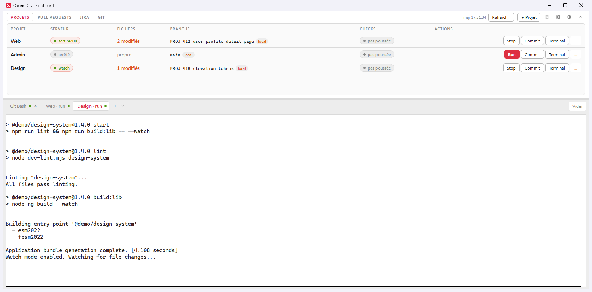

# Oxum Dev Dashboard

A terminal with a status strip above it. The strip tells you where each front-end project stands
(dev server, git, GitHub checks); every action it offers runs in a tab of that same terminal, so
nothing ever sends you to an external console.

## Install

**[Download the installer](https://github.com/jpaniagua-dev/oxum-dev-dashboard/releases/latest/download/oxum-dev-dashboard-win-x64-setup.exe)**,
always the latest version, and run it. The build is not code-signed: when SmartScreen says
**"Windows protected your PC"**, click **More info**, then **Run anyway**. The installer is per-user
and needs no administrator rights.

It needs **git** and works best with **`gh`** signed in and **Claude Code**; Git Bash and a Jira token
are optional. What each one is for, and the first launch in four steps, are in
**[Getting started](docs/getting-started.md)**.

## Documentation

Everything else is in **[docs/](docs/README.md)**: the settings, the terminal, one page per tab,
troubleshooting, and building from source.

## License

MIT. See [LICENSE](LICENSE).
